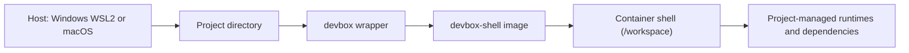

# Thin Docker Dev Shell

[](https://github.com/xrf9268-hue/thin-devbox-shell/actions/workflows/docker-build-check.yml)
[](https://github.com/xrf9268-hue/thin-devbox-shell/actions/workflows/docker-build.yml)

A thin, language-agnostic Docker shell for day-to-day project work on:

- Windows with WSL2 and the Codex app
- macOS with the Codex app

The image includes only common command-line tools. Each project keeps control of its own runtime, package manager, and dependency setup.

The primary workflow is host-first: use the Codex app on the host machine to open the repository, supervise agents, review diffs, and manage parallel tasks. Use `devbox` when you or an agent need a consistent shell inside the current repository or worktree.

## Overview

Use `devbox` as the shared shell, and let each project decide how to install its own toolchain.



## Codex App Workflow

Use the Codex app as the main control surface for development work:

1. Open the repository in the host Codex app.
2. Let Codex manage tasks, diffs, and parallel work from the host.
3. When a task needs a reproducible shell, open a terminal in the current repository or worktree.
4. Run `devbox` from that exact directory.

Examples:

```bash
devbox
devbox bash -lc "git status"
```

If you want shell state isolated per project or per worktree, set a different home volume:

```bash
DEVBOX_HOME_VOLUME=devbox-home-myrepo devbox
```

## Why This Exists

- Reuse one stable shell across different projects and languages
- Keep the base image light and easy to maintain
- Avoid devcontainer sprawl, project templates, and runtime-specific assumptions
- Work the same way on WSL2 and macOS
- Let each repository own its own setup instead of hiding it in a shared image

## What Is Included

- `Dockerfile`: base image for `devbox-shell`
- `devbox`: wrapper that builds and runs the shell
- `install-devbox.sh`: installs a small launcher into `~/.local/bin`
- `docs/consumer-repo-contract.md`: boundaries for repositories that use this shell
- `docs/windows-wsl.md`: Windows and WSL2 host guidance
- `docs/macos.md`: macOS host guidance

Installed tools:

- `bash`
- `curl`
- `git`
- `make`
- `openssh-client`
- `procps`
- `ripgrep`
- `tini`
- `unzip`
- `xz-utils`

## Design Rules

- Thin base image first
- No language runtime baked in
- No project-specific automation in the shared shell
- Cross-platform shell workflow over editor-specific integration
- Codex app on the host, reusable shell from the current repo or worktree
- Make the common layer boring, stable, and easy to replace

## Consumer Repositories

Treat `devbox` as an optional execution layer, not as a project template or a
repository policy engine.

Repositories that use this shell should keep their own:

- setup and prerequisite docs
- build, test, and release workflows
- CI rules and branch policies
- agent prompts, AGENTS guidance, and task-specific scripts

See `docs/consumer-repo-contract.md` for the generic integration contract.

## Quick Start

Install the launcher:

```bash
bash ./install-devbox.sh
```

Start a shell in any project directory:

```bash
cd /path/to/project
devbox
```

Run a one-shot command:

```bash
devbox bash -lc "git --version && pwd"
```

Force a rebuild of the image:

```bash
devbox --rebuild
```

Typical project flow:

```bash
cd ~/projects/my-project
devbox
# inside the shell, use the setup defined by the project itself
```

## Developing a Project

Use the shell as a thin execution layer, not as a project template.

1. Open the repository or worktree in the host Codex app.
2. Open a terminal in that exact repository or worktree directory.
3. Run `devbox`.
4. Inside the container, run the setup, build, test, and debug commands defined by that project.
5. Exit with `exit` when you are done. Re-enter with `devbox` from the same directory.

Example:

```bash
# host terminal
cd ~/projects/my-project
devbox

# inside /workspace in the container
git status
make test
```

What persists:

- Files under `/workspace` are the files from your host repository or worktree.
- Files under `/home/dev` persist in the Docker volume `devbox-home` and are suitable for shell history or user-level cache state.

What does not happen automatically:

- No language runtime is installed for you.
- No per-project bootstrap runs for you.
- No ports, SSH agent, or editor integration are injected for you.

If a project or this shared shell changes:

- Rerun `devbox` for normal project changes.
- Run `devbox --rebuild` after changing the shared image or launcher behavior.
- Set `DEVBOX_HOME_VOLUME=...` when you want isolated shell state per repository or per worktree.

## How It Works

- The current directory is mounted to `/workspace`
- `/home/dev` is stored in the named Docker volume `devbox-home`
- The image is built automatically on first run
- The default container user is `dev`
- Run `devbox` from the repository or worktree you want the shell to operate on
- No ports, SSH agents, or language-specific environment variables are injected automatically

## CI

GitHub Actions runs two minimal Docker checks on pushes to `main`, pull requests, and manual dispatch:

- `Docker Build Check`: equivalent to `docker build --check .`
- `Docker Build`: equivalent to `docker build --pull .`

These workflows only validate the shared shell image. They do not install or test project-specific runtimes.
Both workflows run with read-only repository permissions (`contents: read`).

## Public Interface

- `devbox`
- `devbox --rebuild`
- `devbox <command...>`
- `DEVBOX_IMAGE`
- `DEVBOX_HOME_VOLUME`

## Non-Goals

- No project templates
- No language-specific bootstrap hooks
- No automatic runtime installation
- No per-project system package management
- No hidden magic beyond "mount this directory and give me a clean shell"

If a project needs Node, Rust, Go, Python, Java, or other tooling, that project should install and manage it itself.

## FAQ

### Why not bake Node, Python, Go, or Rust into the image?

Because this layer is meant to stay thin, stable, and reusable across unrelated projects.
Language runtimes change faster than the shared shell should.
If a project needs a runtime, that project should define and version it explicitly.

### Why not use a devcontainer instead?

Because this repository is intentionally smaller in scope.
It provides one reusable shell layer for Codex-driven project work without introducing editor-specific configuration or a per-project template model.
If a project needs a full devcontainer, that project can still add one separately.

### When should a project use its own dedicated development image?

Use a project-specific image when the project needs one or more of the following:

- A fixed language runtime or toolchain
- System packages beyond this shared shell
- Reproducible setup for a team or CI job
- Long-lived background services or port mappings
- Project-specific bootstrap logic that would be wrong to share globally

## Host Setup

- Windows and WSL2: `docs/windows-wsl.md`
- macOS: `docs/macos.md`
